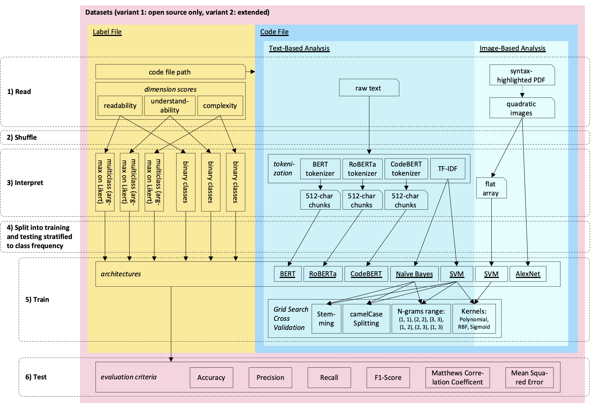

# Readme

This archive was created along the work described in detail in

*M. Schnappinger, S. Zachau, A. Fietzke, and A. Pretschner, "A Preliminary Study on Using Text- and Image-Based Machine Learning to Predict Software Maintainability", Software Quality Days Conference (SWQD), 2022*

# Modules

| Name | Description |
| ---- | ----------- |
| `main` | Program flow that fetches the dataset and runs the approaches |
| `dataset` | General preprocessing of the label files and code files |
| `approaches_bert` | BERT approaches including a train and test method |
| `approaches_cnn` | Convolutional Neural Network (such as AlexNet) approaches including a train and test method |
| `approaches_sklearn` | Naïve Bayes and SVM approaches including a train and test method |
| `evaluation` | Function for evaluating every test result |
| `utils` | Functions that are imported in the modules above |
| `convert_pdfs_to_images` | Create images from PDFs |

# Overview



# Usage Instructions

## Set Up Environment

Choose your favourite Python environment manager, we are using [Miniconda](https://docs.conda.io/en/latest/miniconda.html) in the following.


1. Set up clean environment based on Python <3.7 (Tensorflow 2.x is only compatible with Python <3.7; replace `myenv` with your favourite name):
```sh
conda create -n myenv pip python=3.7
conda activate myenv
```

2. Install all requirements:
```sh
# Option 1: Our versioning
pip install -r source_code/requirements.txt

# Option 2: Manually
pip install numpy pandas tensorflow torch transformers Keras scikit-learn scikit-image scipy nltk matplotlib plotly opencv-python
```

3. Set up dataset

We use the [Software Maintainability Dataset](https://figshare.com/articles/dataset/_/12801215/3) and reference the directory locally as `dataset`. Check *How to Extend the Setup > Add to Dataset* in this Readme for more details.

## Run

```sh
python source_code/main.py
```

Results are saved in the `logs` folder.

## Common Error Messages, Warnings, or Other Unpleasant Observations

| Observation | Explanation / Solution |
| ----------- | ---------------------- |
| `/usr/local/lib/python3.7/dist-packages/sklearn/metrics/_classification.py:1272: UndefinedMetricWarning: Precision and F-score are ill-defined and being set to 0.0 in labels with no predicted samples. Use 'zero_division' parameter to control this behavior. _warn_prf(average, modifier, msg_start, len(result))` | Some classes were not predicted at all, which makes some results skewed. In this case we are printing out 2 versions of the result: One with only the predicted classes and one with all classes including the unpredicted ones. |
| `CUDA out of memory.` or `Your session crashed after using all available RAM.` | The config needs better hardware. |
| An Image-Based Algorithm Performs Badly | You can test the following: Set `is_run_as_dummy` in `main.py` to `True` in order to use black images for all dataset entries for which the readability has the class "0". This enhances the contrast to all other images, which are mainly white. When executing image-based algorithms now and the readability scores are above-average, it proves that the algorithm implementation works and that the bad performance is due to the use case. |

## How to Extend the Setup

### Add to Dataset

For any approach:

1. Add the code folders and the `.csv` label file to the `dataset` folder.

2. Add the `.csv` label file to the dataset initialization in the program flow in the `main` module. Make sure that the delimiter is a semicolon and not a comma to ensure cross-platform compatibility (commas are already used in the scores).

For image-based approaches, create images for each code file:

3. Convert to PDF with [PDFCode](https://github.com/xincoder/PDFCode):

```sh
# general command: pdfcode [source path] -s a4 -m 0 -S colorful --dst [target path]
pdfcode ./dataset -s a4 -m 0 -S colorful --dst ./dataset_PDFCode_results
```

In rare cases it happens that no PDF is created for a code file. We are not sure when/why this happens.

4. Convert PDFs to images:

```sh
# Install poppler, e.g. for Mac:
brew install poppler

python source_code/convert_pdfs_to_images.py
```

### Add Another Text-Based Approach

Simple text-based approaches can be added as follows.

1. In the module `approaches_sklearn` duplicate for example the class `SVMTextBased` and call it `YOUR_APPROACH`.
2. Adjust the duplicate to fit your needs, ie. set a title, a vectorizer, the approach, and optionally custom parameters.
3. Import the class in the module `main` and add `run_approaches_other(dataset, dimension, YOURAPPROACH(), 'code', frac_training, frac_test)`at the bottom with `YOURAPPROACH` being the class name.

If the text-based approach that you like to add needs a custom integration, such as BERT, create another module that exposes a train and test method such that it can be called from `main` similarly to above.

### Add Another Image-Based Approach

Naive image-based approaches can be added in the same way as naive text-based approaches - this time orient yourself by the class `SVMImageBased`.

Approaches based on Convolutional Neural Networks can be added as follows.

1. In the module `approaches_cnn` duplicate for example the class `AlexNet` and call it `YOUR_APPROACH`.
2. Adjust the duplicate to fit your needs by setting a title, image size, and defining the layers.
3. Import the class in the module `main` and add `run_approaches_other(dataset, dimension, YOURAPPROACH(), 'image_path', frac_training, frac_test)` at the bottom with `YOURAPPROACH` being the class name.

### Use Image Normalization

Image normalization makes the code in each image the same size, such that for files with less code there is more white space at the bottom of the image.

⚠️ Warning: Not recommended as it does not lead to better results. The maximum PDF length is 28 pages, which makes the code area too tiny to evaluate anything.

1. Run the file `convert_pdfs_to_images.py` with the commented code uncommented in its main method
2. Uncomment the commented code in the `set_images_paths` method in `dataset.py` to have the file paths in the dataset available in the column `dataset_images_normalized`

### Use Other Label Interpretations Such As Regression Models

All models currently used in this repo are classification models as the dataset should be interpreted in this way according to its creators. In case you still like to play with regression models you can interpret the score inputs as floats by using the dataset column `dimensions_classes_expectation_value` instead of `dimensions_highest_probability_class` and `dimensions_highest_probability_class_simplified` in the program flow in the `main` module.

The following interpretations are available:

| Column Name | Description |
| ----------- | ----------- |
| `dimensions_highest_probability_class` | Take the argmax of the Likert scale ratings, thus resulting in 4 possible discrete classes (strongly agree, weakly agree, weakly disagree, strongly disagree) => the dataset is very imbalanced |
| `dimensions_highest_probability_class_simplified` | Binary approach to cope with imbalance: the 3 least represented classes are merged into 1 class, such that the result are 2 discrete classes (agree, disagree) that are roughly balanced |
| `dimensions_classes_expectation_value` | Calculate the expectation value of the given probabilites for the Likert scale ratings |
